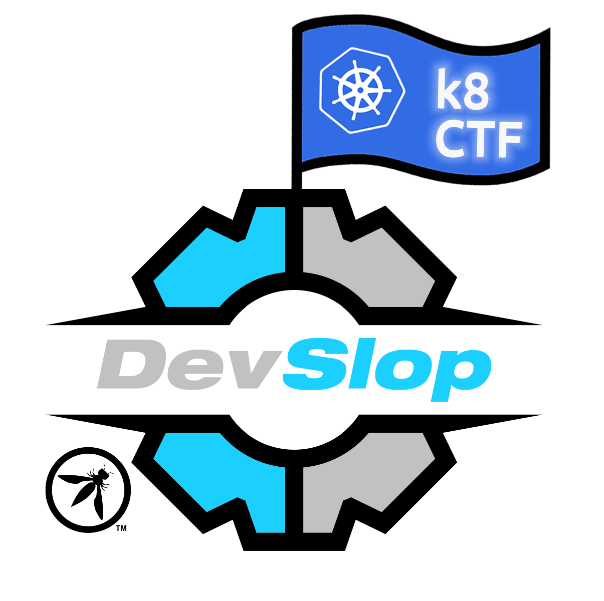

This workshop/CTF is part of the [OWASP DevSlop](https://www.devslop.co) project was hosted at the 2021 Diana Initiative CTF.  It is intended to be beginner-friendly CTF on a lightweight, low-cost Kubernetes setup, that you can run in your own AWS account. Its format is a little different than normal CTF's. The goal is to introduce you gently to Kubernetes concepts (learning exercises) and then to break the security of something (breaker exercises) and finally to fix the thing you just broke (builder exercises).  We hope that this format helps you learn the introductory concepts well enough to understand why you are able to violate security and then solve the underlying security problem.

Big shout out to the Kops team. Without Kops this would have made individualized Kubnernetes clusters near impossible to be both low cost and light weight.

Most of this CTF was built by [@thedeadrobots](https://twitter.com/thedeadrobots)

## To get started head to the [Start_Here.md](https://github.com/DevSlop/k8ctf/blob/master/Start_here.md) page to build out your cluster.

| Challenge     | Description   | Type  |
| ---------     | -----------   | ----  |
| [Challenge 01](https://github.com/DevSlop/k8ctf/blob/master/challenge_01/challenge_01.md) | K8 Overview - History of Virutalization | Learner |
| [Challenge 02](https://github.com/DevSlop/k8ctf/blob/master/challenge_02/challenge_02.md) | K8 Overview - Overview of Docker/Containers | Learner |
| [Challenge 03](https://github.com/DevSlop/k8ctf/blob/master/challenge_03/challenge_03.md) | K8 Overview - What is Orchestration? | Learner |
| [Challenge 04](https://github.com/DevSlop/k8ctf/blob/master/challenge_04/challenge_04.md) | K8 Overview - History of Kubernetes | Learner |
| [Challenge 05](https://github.com/DevSlop/k8ctf/blob/master/challenge_05/challenge_05.md) | K8 Overview - Kubernetes Architecture | Learner |
| [Challenge 06](https://github.com/DevSlop/k8ctf/blob/master/challenge_06/challenge_06.md) | K8 Overview - Kubernetes Objects & Organization | Learner |
| [Challenge 07](https://github.com/DevSlop/k8ctf/blob/master/challenge_07/challenge_07.md) | K8 Setup - Logging into Kubernetes | Builder |
| [Challenge 08](https://github.com/DevSlop/k8ctf/blob/master/challenge_08/challenge_08.md) | K8 Setup - Using `kubectl` | Builder |
| [Challenge 09](https://github.com/DevSlop/k8ctf/blob/master/challenge_09/challenge_09md) | K8 Setup - Kubernetes AuthN/AuthZ Overview | Learner |
| [Challenge 10](https://github.com/DevSlop/k8ctf/blob/master/challenge_10/challenge_10.md) | K8 Setup - Kubernetes Dashboard | Builder |
| [Challenge 11](https://github.com/DevSlop/k8ctf/blob/master/challenge_11/challenge_11.md) | K8 Networking - ClusterIP | Builder |
| [Challenge 12](https://github.com/DevSlop/k8ctf/blob/master/challenge_12/challenge_12.md) | K8 Networking - NodePort | Builder |
| [Challenge 13](https://github.com/DevSlop/k8ctf/blob/master/challenge_13/challenge_13.md) | K8 Networking - LoadBalancer | Builder |
| [Challenge 14](https://github.com/DevSlop/k8ctf/blob/master/challenge_14/challenge_14.md) | K8 Deployment - Simple Deployment | Builder |
| [Challenge 15](https://github.com/DevSlop/k8ctf/blob/master/challenge_15/challenge_15.md) | K8 Deployment - Rolling Updates | Builder |
| [Challenge 16](https://github.com/DevSlop/k8ctf/blob/master/challenge_16/challenge_16.md) | K8 Security - Finding Creds in Code | Breaker |
| [Challenge 17](https://github.com/DevSlop/k8ctf/blob/master/challenge_17/challenge_17.md) | K8 Security - Using Kube Secrets | Builder |
| [Challenge 18](https://github.com/DevSlop/k8ctf/blob/master/challenge_18/challenge_18.md) | K8 Security - SSRF on K8 | Breaker |
| [Challenge 19](https://github.com/DevSlop/k8ctf/blob/master/challenge_19/challenge_19.md) | K8 Security - Finding SSRF bugs with Semgrep | Builder |
| [Challenge 20](https://github.com/DevSlop/k8ctf/blob/master/challenge_20/challenge_20.md) | K8 Security - Container Escape to Host | Breaker |
| [Challenge 21](https://github.com/DevSlop/k8ctf/blob/master/challenge_21/challenge_21.md) | K8 Security - Intro to OpenPolicyAgent | Learner |
| [Challenge 22](https://github.com/DevSlop/k8ctf/blob/master/challenge_22/challenge_22.md) | K8 Security - OPA to Restrict Host Access | Builder |
| [Challenge 23](https://github.com/DevSlop/k8ctf/blob/master/challenge_23/challenge_23.md) | K8 Security - Namespace Bypass | Breaker |
| [Challenge 24](https://github.com/DevSlop/k8ctf/blob/master/challenge_24/challenge_24.md) | K8 Security - Prevent Namespace Bypass w/ Cilium | Builder |
| [Challenge 25](https://github.com/DevSlop/k8ctf/blob/master/challenge_25/challenge_25.md) | K8 Security - Consume Cluster Resources / DoS | Breaker |
| [Challenge 26](https://github.com/DevSlop/k8ctf/blob/master/challenge_26/challenge_26.md_) | K8 Security - OPA to Enforce Resource Limits | Builder |
| [Challenge 27](https://github.com/DevSlop/k8ctf/blob/master/challenge_27/challenge_27.md) | K8 Security - Scanning Containers for Vulnerabilities | Breaker |
| [Challenge 28](https://github.com/DevSlop/k8ctf/blob/master/challenge_28/challenge_28.md) | K8 Security - OPA to Enforce Trusted Image Sources | Builder |
| [Challenge 29](https://github.com/DevSlop/k8ctf/blob/master/challenge_29/challenge_29.md) | K8 Security - Using Kube-Bench | Builder |

#TODO
Support / Maintenance